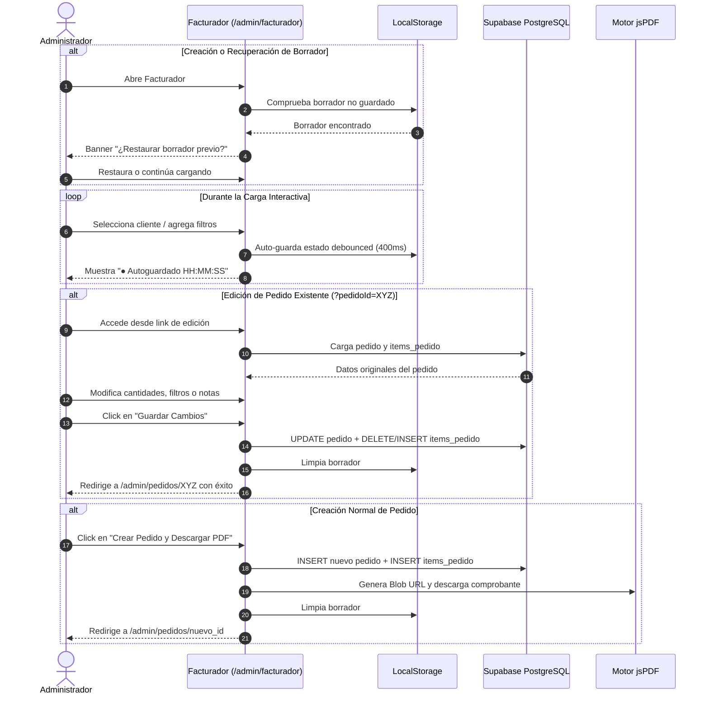

# Arquitectura del Sistema FHL Filtros

Este documento describe la arquitectura global del software, los diagramas de componentes, el flujo de datos y los subsistemas de **FHL Filtros**.

---

## 1. Topología del Proyecto

La solución está construida sobre **Next.js (App Router)** y **Supabase (PostgreSQL)**, separada en dos áreas funcionales:

```
c:\fhl_filtros\
├── app/
│   ├── page.tsx                      ← Catálogo Público (Búsqueda por código o vehículo)
│   ├── layout.tsx                    ← Layout Público (Navbar + WhatsApp + Footer)
│   ├── contacto/page.tsx             ← Página de contacto institucional
│   ├── quienes-somos/page.tsx        ← Página institucional
│   │
│   ├── admin/
│   │   ├── layout.tsx                ← Layout Admin protegido con AdminAuthGuard
│   │   ├── page.tsx                  ← Dashboard Admin (6 tarjetas de acceso rápido)
│   │   ├── login/page.tsx            ← Pantalla de Login Full-Screen (HMAC-SHA256)
│   │   ├── facturador/page.tsx       ← Facturador, Presupuestador, Edición & Borradores
│   │   ├── pedidos/page.tsx          ← Listado de Pedidos y Cobranzas
│   │   ├── pedidos/[id]/page.tsx     ← Detalle de Pedido, Pagos y Descarga PDF
│   │   ├── clientes/page.tsx         ← Listado de Clientes y Resumen de Deudas
│   │   ├── clientes/[id]/page.tsx    ← Perfil de Cliente, Cuentas Corrientes y Precios Especiales
│   │   ├── productos/page.tsx        ← Catálogo de Filtros y Autos + Importador Excel Masivo
│   │   ├── listas-precios/page.tsx   ← Gestión de Listas de Precios Directas e Importador 2-Cols
│   │   └── auditoria/page.tsx        ← Asistente Técnico y Auditor de Catálogo con IA
│   │
│   └── api/
│       ├── auth/login/route.ts       ← Emisión de Cookie HttpOnly HMAC-SHA256
│       ├── auth/logout/route.ts      ← Invalidation de Sesión
│       ├── auth/check/route.ts       ← Verificación Criptográfica de Sesión
│       ├── admin/auditoria-chat/     ← Chat de IA protegido (OpenRouter Proxy)
│       └── admin/auditoria-excel/    ← Auditoría masiva de Excel con IA
│
├── lib/
│   ├── supabase.ts                   ← Cliente Singleton de Supabase
│   ├── types.ts                      ← Modelos de datos TypeScript
│   └── generarPDF.ts                 ← Generador de Comprobantes PDF (jsPDF)
└── DOCUMENTACION_SISTEMA.md          ← Manual Técnico Completo
```

---

## 2. Diagrama de Arquitectura Global

```mermaid
graph TD
    %% Estilos
    classDef client fill:#eff6ff,stroke:#2563eb,stroke-width:2px;
    classDef server fill:#fff7ed,stroke:#ea580c,stroke-width:2px;
    classDef db fill:#f0fdf4,stroke:#16a34a,stroke-width:2px;
    classDef ext fill:#fdf4ff,stroke:#c026d3,stroke-width:2px;

    subgraph Frontend_Usuario ["Catálogo Público"]
        CatWeb["Buscador Código & Autos (app/page.tsx)"]:::client
        Modal["Ficha Técnica Modal (?filtro=ID)"]:::client
    end

    subgraph Frontend_Admin ["Panel de Administración (/admin)"]
        AuthGuard["AdminAuthGuard (Cookie Check)"]:::client
        Dash["Dashboard General"]:::client
        Fact["Facturador & Editor de Pedidos"]:::client
        Draft["LocalStorage Draft Manager"]:::client
        Listas["Listas de Precios Directas"]:::client
        Ped["Pedidos & Cobranzas"]:::client
        Cli["Clientes & Cuentas Corrientes"]:::client
        Prod["Catálogo & Importador Excel"]:::client
        Aud["Auditoría IA"]:::client
    end

    subgraph Backend_Next ["Next.js Server & API Routes"]
        ApiAuth["/api/auth/* (HMAC Session)"]:::server
        ApiChat["/api/admin/auditoria-chat"]:::server
        ApiExcel["/api/admin/auditoria-excel"]:::server
        PDFEngine["jsPDF Engine (generarPDF.ts)"]:::server
    end

    subgraph Storage_Supabase ["Supabase Backend"]
        DB[(PostgreSQL Database)]:::db
        Bucket[(Storage: 'productos')]:::db
    end

    subgraph Servicios_Externos ["Servicios Externos"]
        OR["OpenRouter AI (Nemotron Nano :free)"]:::ext
    end

    %% Relaciones
    CatWeb --> DB
    Modal --> DB
    Fact <--> Draft
    Fact --> PDFEngine
    AuthGuard --> ApiAuth
    Aud --> ApiChat
    Aud --> ApiExcel
    ApiChat --> OR
    ApiExcel --> OR
    Fact --> DB
    Listas --> DB
    Ped --> DB
    Cli --> DB
    Prod --> DB
    Prod --> Bucket
```



---

## 3. Flujo de Datos del Facturador & Editor de Pedidos



---

## 4. Principios de Diseño y Estándares de Código

1. **Server Components por Defecto**: Las páginas cargan estructura estática y solo los árboles que demandan interactividad o estado (`useSearchParams`, inputs, drag & drop) se declaran con `'use client'`.
2. **Control por URL**: El modal del catálogo público responde a `?filtro=CODIGO`, garantizando deep linking y respetando la navegación del historial del navegador sin estados locales frágiles.
3. **Seguridad de Secretos**: Ningún token (`OPENROUTER_API_KEY`, `ADMIN_SECRET`) se expone en componentes del cliente. Todo acceso a APIs de IA y autenticación viaja por endpoints de servidor protegidos.
4. **Resiliencia de Datos**:
   - Autoguardado reactivo para evitar pérdidas de trabajo por cortes de conexión.
   - Soporte de papelera (`soft-delete`) en pedidos, clientes, listas de precios y catálogo para prevenir borrados accidentales.