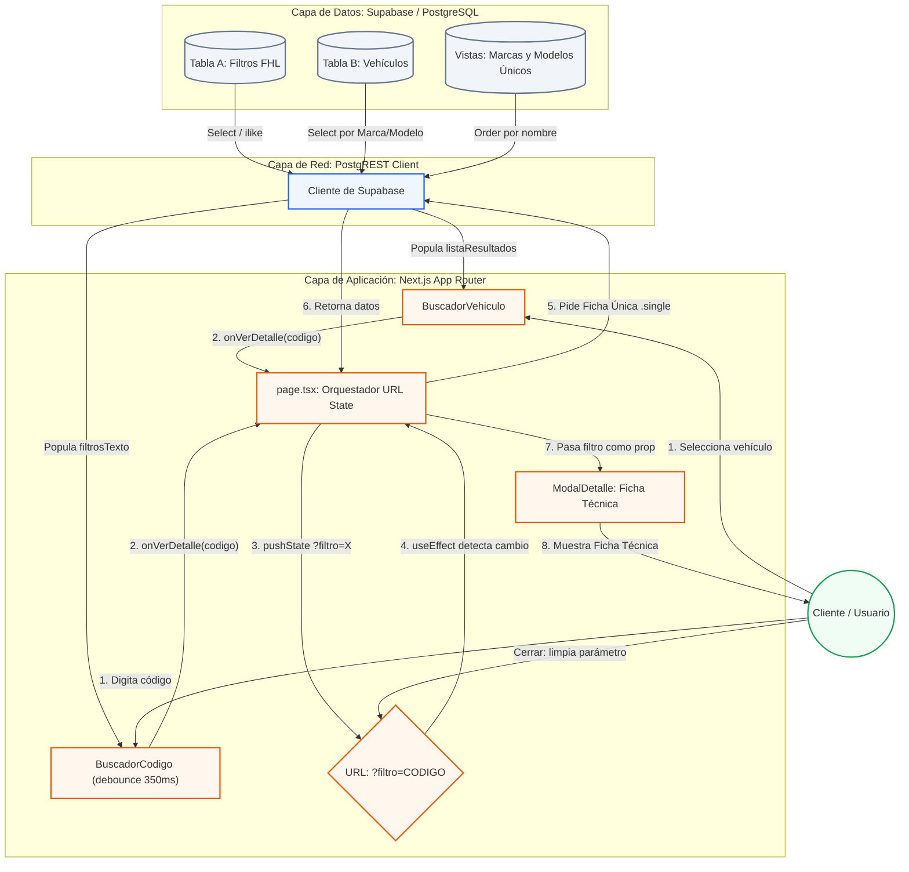

# Arquitectura del Sistema

## Estado Actual: Catálogo de Solo Lectura
El sistema se nutre de Supabase. Para optimizar el rendimiento, se utilizan Vistas Materializadas o Tablas de cruce para evitar consultas pesadas.

### Funcionalidades

* **Búsqueda por Vehículo** (`BuscadorVehiculo`): Consulta `Tabla B` (marcas/modelos) cruzado con el filtro asociado. Cascada de selects: Marca → Modelo → Buscar.
* **Búsqueda por Código** (`BuscadorCodigo`): Consulta `Tabla A` (filtros) mediante coincidencias (ilike) normalizando guiones y espacios. Implementa debounce de 350ms para evitar requests excesivos.
* **Ficha Técnica** (`ModalDetalle`): NO utiliza un estado local booleano aislado. La apertura del modal se controla mediante la URL (`?filtro=CODIGO`). Esto permite compartir enlaces directos a filtros específicos y respeta el historial del navegador.
  * **Scroll Locking:** Al abrir el modal se bloquea el scroll del `body` (`overflow: hidden`). Al activar el zoom de imagen, se bloquea además el scroll interno del modal. Ambos se restauran al cerrar.
  * **Rendimiento:** Se evita `backdrop-filter: blur()` en el overlay por su alto costo de GPU en cada frame de scroll. Se usa `will-change: transform` en el contenedor scrolleable para promoverlo a su propia capa de composición.
  * **Accesibilidad:** El modal incluye `role="dialog"`, `aria-modal="true"` y `aria-label` descriptivo.

### Estructura de Componentes

```
app/
├── page.tsx                  ← Orquestador (~95 líneas). Gestiona URL state y conecta componentes.
├── layout.tsx                ← Layout raíz: Navbar + children + Footer + WhatsAppButton
├── components/
│   ├── Navbar.tsx            ← Navegación responsive. Usa <Link> con limpieza de ?filtro.
│   ├── Footer.tsx            ← Footer (Server Component)
│   ├── WhatsAppButton.tsx    ← Botón flotante global (Server Component)
│   ├── BuscadorVehiculo.tsx  ← Búsqueda por vehículo (Client Component, estado propio)
│   ├── BuscadorCodigo.tsx    ← Búsqueda por código con debounce (Client Component, estado propio)
│   └── ModalDetalle.tsx      ← Ficha técnica con galería/zoom (Client Component, estado propio)
├── contacto/page.tsx         ← Página de contacto (Server Component)
└── quienes-somos/page.tsx    ← Página institucional (Server Component)

lib/
├── supabase.ts               ← Cliente Supabase (singleton)
└── types.ts                  ← Interfaces TypeScript: Filtro, ResultadoVehiculo
```

### Patrón de comunicación entre componentes

`page.tsx` es el orquestador central. No contiene lógica de búsqueda ni UI de modal. Su rol:
1. Lee `useSearchParams` para saber si hay un `?filtro=CODIGO` en la URL.
2. Expone `abrirFiltro(codigo)` como callback `onVerDetalle` a los buscadores.
3. Pasa `filtroDetalle` y `cerrarModal` al `ModalDetalle`.

Cada buscador es autónomo: gestiona su propio estado, queries a Supabase y errores.

## Roadmap / Backlog (A futuro)
* **Fase 2 - E-commerce Asincrónico:** Implementación de un carrito de compras (Zustand) donde el cliente envía una "Solicitud de Pedido". El stock y el precio no se mostrarán en vivo; un administrador los confirmará manualmente contra su Excel físico antes de emitir un link de pago (Mercado Pago).

### Mapa de Arquitectura Actual

