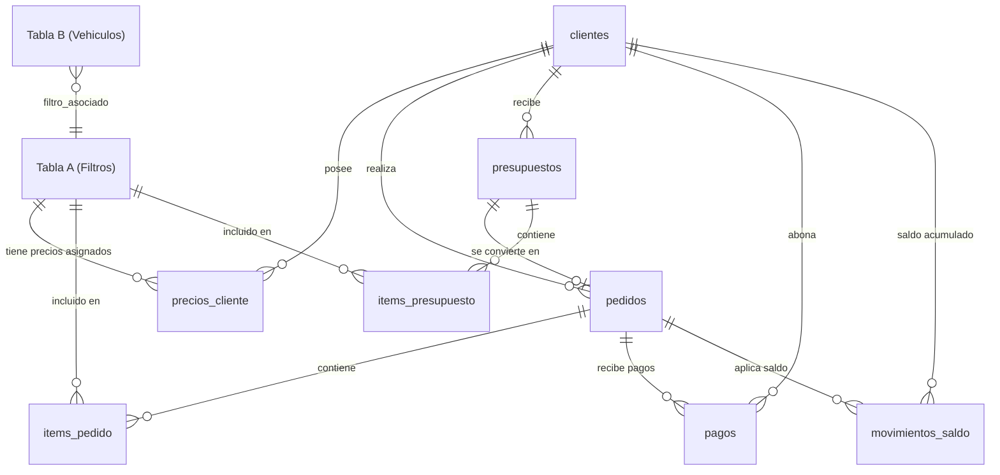

# FHL Filtros — Documentación Integral del Sistema y Panel de Administración

Este documento describe la arquitectura técnica, modelo de datos, flujos comerciales, endpoints y componentes implementados en la plataforma **FHL Filtros**.

---

## 1. Visión General del Proyecto

La plataforma combina:
1. **Catálogo Público de Consulta Rápida B2B/B2C**: Búsqueda ultrarrápida por código de filtro (FHL, OEM, cruzadas) o por modelo de vehículo, con fichas técnicas, dimensiones y fotos. Los precios se mantienen estrictamente ocultos del público general.
2. **Panel de Administración Integral (`/admin`)**: Sistema de gestión comercial, financiero y operativo que cubre productos, carga masiva, clientes, cuenta corriente (deudas y saldo a favor), pedidos, pagos y presupuestación con exportación en PDF.

---

## 2. Stack Tecnológico

- **Framework**: [Next.js](https://nextjs.org/) (App Router, Server Components y Client Components selectivos).
- **Lenguaje**: TypeScript.
- **Base de Datos & Storage**: [Supabase](https://supabase.com/) (PostgreSQL + Supabase Storage Bucket `productos`).
- **Estilos**: TailwindCSS (diseño limpio, profesional, sin emojis).
- **Procesamiento de Archivos**:
  - `xlsx` para importación y previsualización de planillas Excel (`.xlsx`, `.xls`) y `.csv`.
  - `jspdf` y `jspdf-autotable` para generación y descarga inmediata de presupuestos y comprobantes en PDF.
  - HTML5 Canvas API para compresión automática y conversión de imágenes a WebP en el navegador antes del upload.
- **Seguridad**: Autenticación HMAC-SHA256 con cookies seguras `HttpOnly` y protección en cliente mediante `AdminAuthGuard`.

---

## 3. Modelo de Base de Datos (Supabase PostgreSQL)



### Detalle de Tablas

#### 1. `"Tabla A"` (Catálogo de Filtros)
| Columna | Tipo | Descripción |
| :--- | :--- | :--- |
| `id` | BIGINT (PK) | Identificador autoincremental |
| `codigo_fhl` | TEXT (UNIQUE) | Código FHL en mayúsculas (ej: `FHL-001`) |
| `equivalencias` | TEXT | Códigos OEM y referencias cruzadas |
| `dimensiones` | TEXT | Medidas técnicas (ej: `Alto: 30mm, Diámetro: 200mm`) |
| `descripcion_aplicacion` | TEXT | Resumen de vehículos compatibles |
| `imagen_url` | TEXT / JSON | Array serializado con URLs de imágenes en Supabase Storage |
| `buscador_unificado` | TEXT | Texto normalizado sin espacios ni guiones para búsqueda |
| `precio` | NUMERIC(12,2) | Precio base de facturación interna (no visible en web) |
| `activo` | BOOLEAN | `true` para visible en catálogo web, `false` para oculto |
| `eliminado` | BOOLEAN | `true` para papelera (soft-delete), `false` para activo |

#### 2. `"Tabla B"` (Aplicaciones por Vehículo)
| Columna | Tipo | Descripción |
| :--- | :--- | :--- |
| `id` | BIGINT (PK) | Identificador autoincremental |
| `marca` | TEXT | Marca del vehículo (ej: `FORD`, `VOLKSWAGEN`) |
| `modelo` | TEXT | Modelo (ej: `FOCUS`, `GOL`) |
| `version` | TEXT | Motorización / versión (ej: `2.0 16V`) |
| `año` | TEXT | Rango de años (ej: `2012 ->`) |
| `filtro_asociado` | TEXT | Código FHL vinculado |
| `eliminado` | BOOLEAN | Estado de papelera |

#### 3. `clientes` (Cuentas Corrientes & Clientes)
| Columna | Tipo | Descripción |
| :--- | :--- | :--- |
| `id` | UUID (PK) | Identificador único |
| `nombre` | TEXT | Razón social o nombre comercial |
| `cuit` | TEXT | CUIT / Identificación fiscal |
| `condicion_iva` | VARCHAR(50) | Responsable Inscripto, Monotributo, Exento, Consumidor Final |
| `tipo_cliente` | VARCHAR(50) | Mayorista, Distribuidor, Casa de Repuestos, Taller Mecánico, Minorista |
| `email` | TEXT | Correo electrónico de contacto |
| `telefono` | TEXT | Teléfono / WhatsApp |
| `direccion` | TEXT | Domicilio comercial o de entrega |
| `ciudad` | TEXT | Localidad / Ciudad |
| `provincia` | TEXT | Provincia |
| `descuento_predeterminado` | NUMERIC(5,2) | Descuento comercial base (%) |
| `plazo_pago` | VARCHAR(50) | Contado, 15 días, 30 días, 45 días, 60 días, Cuenta Corriente |
| `notas` | TEXT | Observaciones internas |
| `eliminado` | BOOLEAN | Estado de papelera |
| `created_at` | TIMESTAMPTZ | Fecha de alta |

#### 4. `precios_cliente` (Listas de Precios Personalizadas)
| Columna | Tipo | Descripción |
| :--- | :--- | :--- |
| `id` | BIGINT (PK) | Identificador |
| `cliente_id` | BIGINT (FK -> clientes) | Cliente propietario de la tarifa |
| `codigo_fhl` | TEXT | Código de filtro al que aplica |
| `precio` | NUMERIC(12,2) | Precio especial acordado |
| `*Unique*` | `(cliente_id, codigo_fhl)` | Evita duplicados por cliente y filtro |

#### 5. `presupuestos` & `items_presupuesto`
- `presupuestos`: almacena número correlativo (`id`), cliente vinculado, fecha, subtotal, descuento, total y estado (`emitido`, `convertido`).
- `items_presupuesto`: desglose de códigos, cantidades, precios unitarios y subtotales.

#### 6. `pedidos` & `items_pedido`
- `pedidos`: almacena el pedido de compra con estado (`pendiente`, `confirmado`, `entregado`, `cancelado`), cliente vinculado, presupuesto de origen opcional, fecha de entrega estimada y notas.
- `items_pedido`: artículos solicitados con cantidades y precios acordados.

#### 7. `pagos` (Registro de Cobranzas)
| Columna | Tipo | Descripción |
| :--- | :--- | :--- |
| `id` | BIGINT (PK) | Identificador |
| `pedido_id` | BIGINT (FK -> pedidos) | Pedido al que se imputa el pago |
| `cliente_id` | BIGINT (FK -> clientes) | Cliente emisor del pago |
| `monto` | NUMERIC(12,2) | Importe abonado |
| `metodo` | TEXT | `efectivo`, `transferencia`, `cheque`, `mercadopago` |
| `referencia` | TEXT | Número de operación bancaria o comprobante |
| `created_at` | TIMESTAMPTZ | Fecha de cobro |

#### 8. `movimientos_saldo` (Libro Mayor de Saldo a Favor)
- Permite registrar créditos a favor del cliente generados automáticamente por sobrepagos (`tipo = 'excedente'`) o deducciones aplicadas a nuevos pedidos (`tipo = 'aplicado'`).
- El saldo a favor de un cliente es la suma aritmética: `SUM(monto)`.

---

## 4. Estructura de Módulos del Sistema

### 4.1. Catálogo Web Público
- **Ruta**: `/` ([`app/page.tsx`](file:///c:/fhl_filtros/app/page.tsx))
- **Buscador de Códigos**: Filtrado instantáneo en tiempo real (`ilike %termino%`) con normalización de caracteres, omitiendo registros con `activo = false` o `eliminado = true`.
- **Buscador de Vehículos**: Cascada de selección Marca → Modelo → Año/Versión.
- **Ficha Técnica (Modal)**: Controlado estrictamente por URL (`?filtro=FHL-XXX`) sin estados locales booleanos, compatible con navegación atrás/adelante del navegador.

### 4.2. Autenticación & Seguridad del Panel
- **Login**: `/admin/login` ([`app/admin/login/page.tsx`](file:///c:/fhl_filtros/app/admin/login/page.tsx)).
- **Validación de Credenciales**: Variables en `.env.local` (`ADMIN_USER`, `ADMIN_PASSWORD`, `ADMIN_SECRET`).
- **Mecanismo de Token**:
  - `POST /api/auth/login`: Genera un token HMAC-SHA256 con payload `{ user, exp }` y lo almacena en la cookie `fhl_admin_session` (`HttpOnly`, `SameSite=Lax`, `Path=/`).
  - `POST /api/auth/logout`: Elimina la cookie de sesión.
  - `GET /api/auth/check`: Valida la firma del token criptográficamente.
- **Protección de Rutas**: [`AdminAuthGuard.tsx`](file:///c:/fhl_filtros/app/admin/components/AdminAuthGuard.tsx) envuelve todo el layout `/admin` e intercepta accesos no autorizados redirigiendo a `/admin/login`.

### 4.3. Dashboard Principal
- **Ruta**: `/admin` ([`app/admin/page.tsx`](file:///c:/fhl_filtros/app/admin/page.tsx))
- **Módulos de Acceso Directo**: Tarjetas informativas hacia Productos, Clientes, Pedidos, Facturador e Historial.
- **Monitoreo de Actividad**:
  - Últimos pedidos registrados con estado y botón de acceso rápido.
  - Ranking de clientes con mayor deuda pendiente.
  - Últimos presupuestos emitidos con opción de descarga de PDF.

### 4.4. Productos & Catálogo
- **Ruta**: `/admin/productos` ([`app/admin/productos/page.tsx`](file:///c:/fhl_filtros/app/admin/productos/page.tsx))
- **Gestión de Filtros (Tabla A)**:
  - Edición inline y creación con campos: Código FHL, Equivalencias OEM, Dimensiones, Aplicación, Precio Base y Switch de Visibilidad en Web.
  - Filtrado por pestañas: *Todos*, *Visibles en Web* y *Ocultos*.
  - Soft-delete a papelera con opción de restauración o purga física definitiva.
- **Gestor de Imágenes**:
  - Componente [`ImagenUploader.tsx`](file:///c:/fhl_filtros/app/admin/productos/components/ImagenUploader.tsx).
  - Conversión a formato WebP optimizado en el cliente mediante Canvas (`lib/supabase-storage.ts`).
  - Almacenamiento en bucket público `productos` de Supabase Storage.
- **Importador Masivo Excel / CSV**:
  - Componente [`ImportadorExcel.tsx`](file:///c:/fhl_filtros/app/admin/productos/components/ImportadorExcel.tsx).
  - **Descarga de Plantilla Excel**: Genera dinámicamente archivos `.xlsx` (`plantilla_importacion_filtros_fhl.xlsx` y `plantilla_importacion_vehiculos_fhl.xlsx`) con anchos de columna formateados y datos de muestra listos para rellenar.
  - **Mapeo Automático de Columnas**:
    - **Filtros (`Tabla A`)**: Detecta `codigo_fhl`, `equivalencias`, `dimensiones`, `descripcion_aplicacion`, `precio` y `activo` (visibilidad en web).
    - **Autocompletado de Columnas**: Calcula e indexa automáticamente el `buscador_unificado` uniendo y normalizando código + equivalencias + aplicaciones, y establece `eliminado = false`.
    - **Vehículos (`Tabla B`)**: Detecta `marca`, `modelo`, `version`, `año` y `filtro_asociado`.
  - Comparación en memoria con la base de datos para mostrar resumen de filas nuevas, a actualizar, sin cambios y errores antes de ejecutar el `upsert`.

### 4.5. Clientes & Cuenta Corriente
- **Listado General**: `/admin/clientes` ([`app/admin/clientes/page.tsx`](file:///c:/fhl_filtros/app/admin/clientes/page.tsx)).
  - Tarjetas de cliente con indicadores de Deuda Acumulada y Saldo a Favor.
  - Filtros rápidos: *Todos*, *Con Deuda*, *Con Saldo a Favor*, *Al Día*.
  - **Edición y Ajuste Rápido de Saldo**: Botón directo en la tarjeta y en la métrica de Saldo a Favor para abrir el modal de ajuste de cuenta corriente sin salir del listado.
  - **Papelera & Eliminación Definitiva**:
    - **Mover a Papelera**: Soft-delete cambiando `eliminado = true` para evitar pérdidas accidentales.
    - **Restaurar**: Regresa el cliente al listado activo.
    - **Eliminar Definitivo**: Purga completa de la base de datos limpiando en cascada sus precios asignados, pagos, saldos y pedidos.
- **Perfil Individual de Cliente**: `/admin/clientes/[id]` ([`app/admin/clientes/[id]/page.tsx`](file:///c:/fhl_filtros/app/admin/clientes/[id]/page.tsx)).
  - **Modal de Ajuste de Saldo a Favor (`ModalAjusteSaldo.tsx`)**:
    - **Fijar Saldo Exacto**: Permite ingresar el saldo final deseado calculando automáticamente la diferencia e insertando el movimiento contable correspondiente.
    - **Sumar Crédito (+)**: Carga de anticipos, sobrepagos, notas de crédito o bonificaciones.
    - **Restar / Deducir (-)**: Registro de devoluciones en efectivo o compensaciones.
    - Acceso directo desde la tarjeta de Saldo a Favor, barra de acciones superior y pestaña de movimientos.
  - **Pestaña Historial de Pedidos**: Historial completo con estado operativo (pendiente/entregado), estado financiero y deuda restante.
  - **Pestaña Pagos**: Desglose de pagos realizados, método y referencia.
  - **Pestaña Saldo a Favor**: Libro de créditos y deducciones con eliminación / anulación de movimientos individuales con confirmación.
  - **Pestaña Lista de Precios**: Matriz de precios personalizados para el cliente con buscador, agregado rápido y edición inline.

### 4.6. Gestión de Pedidos, Ventas & Cobranzas
- **Listado de Pedidos**: `/admin/pedidos` ([`app/admin/pedidos/page.tsx`](file:///c:/fhl_filtros/app/admin/pedidos/page.tsx)).
  - Dimensión Operativa: Estados *Pendiente*, *Confirmado*, *Entregado*, *Cancelado*.
  - Dimensión Financiera: Indicadores de *Total*, *Pagado*, *Deuda* y filtro rápido *Con Deuda Pendiente*.
  - **Papelera & Eliminación Definitiva**:
    - **Mover a Papelera**: Soft-delete seguro (`eliminado = true`).
    - **Restaurar**: Devuelve el pedido al tablero general con su estado intacto.
    - **Eliminar Definitivo**: Purga permanente de la base de datos removiendo el pedido, sus `items_pedido` y sus registros de `pagos`.
- **Ficha de Pedido & Cobranza**: `/admin/pedidos/[id]` ([`app/admin/pedidos/[id]/page.tsx`](file:///c:/fhl_filtros/app/admin/pedidos/[id]/page.tsx)).
  - **Descarga Inmediata de PDF / Presupuesto**: Genera el comprobante membretado oficial con 1 click.
  - Transiciones de ciclo de vida (`pendiente` → `confirmado` → `entregado`).
  - Registro de pagos con cálculo automático de saldo restante.
  - **Tratamiento de Excedentes**: Si el cliente paga de más, el excedente se acredita automáticamente en `movimientos_saldo` como crédito a favor.
  - **Aplicación de Saldo**: Si el cliente posee saldo a favor previo, se puede imputar directamente al pedido para cancelar deuda.
  - **Banner de Papelera**: Si el pedido está en papelera, advierte al usuario y ofrece botones rápidos de restauración o eliminación irreversible.

### 4.7. Múltiples Listas de Precios & Facturación Dinámica
- **Módulo de Gestión de Tarifas**: `/admin/listas-precios` ([`app/admin/listas-precios/page.tsx`](file:///c:/fhl_filtros/app/admin/listas-precios/page.tsx)).
- **Modalidades de Lista Configurables**:
  1. **Vinculada en Vivo a Costeo de Fábrica (`tipo_ajuste: 'costeo'`)**:
     - Conectada a un canal de costeo específico (*Costo Mayorista Base, MDP con bolsa, Mayorista 1, Mayorista 2, Mayorista 3, Comercio*, o multiplicadores personalizados).
     - **Recálculo automático reactivo**: Si cambia el precio del papel, pegamento, mano de obra o ganancia en `/admin/costeo`, los precios de esta lista se actualizan al instante en el Facturador sin intervención manual.
     - Opciones avanzadas: Ajuste porcentual adicional sobre el canal (ej: $+5\%$, $-3\%$) y regla de redondeo comercial (*Exacto con centavos, Entero, Múltiplos de $10, Múltiplos de $100*).
     - Botón de **"Sincronizar BD"** para generar una copia estática de respaldo en `items_lista_precio`.
  2. **Planilla Excel Fija (`tipo_ajuste: 'excel'`)**:
     - Importación de un archivo Excel con códigos de filtro y precios fijos asociados (útil para listas congeladas por convenio).
  3. **Porcentaje Global (`tipo_ajuste: 'porcentaje'`)**:
     - Listas con descuento o recargo automático sobre el catálogo oficial (`Tabla A`).
- **Importador de Precios por Excel (`ImportadorExcelListaPrecio.tsx`)**:
  - Detección automática de encabezados (`CODIGO`, `CODIGO_FHL`, `FILTRO`, `PRECIO`, `MAYORISTA`, `IMPORTE`).
  - Descarga de plantilla Excel precargada con todos los filtros actuales del catálogo (`Tabla A`).
  - Previsualización y validación de filas antes de guardar con feedback de progreso.
- **Visor & Editor de Matriz de Precios (`ModalVerPreciosLista.tsx`)**:
  - Permite inspeccionar qué productos y precios específicos tiene asignados cada lista.
  - Buscador rápido por código FHL y edición inline de precios.
  - Exportación de la lista a archivo `.xlsx`.
- **Simulador en Vivo**: Permite seleccionar cualquier filtro del catálogo y ver en tiempo real cómo varían los precios finales en listas de costeo, Excel o porcentaje.
- **Asignación por Cliente**: En `/admin/clientes` y `/admin/clientes/[id]`, se puede fijar qué lista de precios tiene asignada cada cliente por defecto.
- **Selector Dinámico en Facturador (`/admin/facturador`)**:
  - Selector interactivo con badges contextuales: `🔗 Costeo (Mayorista 1)`, `Planilla Excel` o `% Descuento`.
  - Auto-selección inteligente de la lista del cliente al elegir el comprador.
  - **Recálculo instantáneo**: Cambiar la lista con productos ya cargados en la tabla consulta al instante el motor de costeo, la matriz de Excel o aplica el porcentaje y actualiza los precios unitarios y el total.
  - Opción de toggle para priorizar o ignorar tarifas especiales fijadas en `precios_cliente`.
- **Ciclo de Vida de Listas (Papelera & Eliminación Definitiva)**:
  - **Mandar a Papelera (Soft Delete)**: `listas_precios.eliminado = true`, oculta la lista del Facturador y del selector de clientes sin perder los datos ni los precios cargados.
  - **Pestaña Papelera**: Vista dedicada con conteo badge donde se pueden inspeccionar las listas borradas y la fecha de eliminación.
  - **Restaurar**: Devuelve la lista al estado activo y disponible en el Facturador.
  - **Eliminación Permanente (Hard Delete)**: Modal de confirmación irreversible que limpia las asignaciones de clientes (`clientes.lista_precio_id = null`), borra los precios asociados en `items_lista_precio` y destruye el registro de la lista de la base de datos.
  - **Vaciar Papelera**: Botón para depurar todas las listas en papelera en un solo paso.
  - **Protección de Lista Predeterminada**: El sistema impide mandar a papelera la lista marcada como predeterminada hasta que se designe otra.

### 4.8. Auditoría Inteligente de Catálogo & Cargas Excel (OpenRouter IA)
- **Módulo Dedicado**: `/admin/auditoria` ([`app/admin/auditoria/page.tsx`](file:///c:/fhl_filtros/app/admin/auditoria/page.tsx)).
- **Motor de Inteligencia Artificial**:
  - Modelo ultra-rápido en español **`nvidia/nemotron-3-nano-30b-a3b:free`** (~420ms) con fallback multi-proveedor a **`openrouter/free`** y **`openai/gpt-oss-20b:free`**.
  - Endpoint Server-Side: `/api/admin/auditoria-excel` ([`app/api/admin/auditoria-excel/route.ts`](file:///c:/fhl_filtros/app/api/admin/auditoria-excel/route.ts)).
- **Auditoría Previa en Cargas Masivas Excel (`ImportadorExcel.tsx`)**:
  - Inspecciona el archivo antes de tocar la base de datos.
  - **Detección de Precios Anómalos**: Alertas por precios en `$0` o precios mayores a `$100.000` (posibles ceros de más o errores de coma decimal).
  - **Detección de Dimensiones Incoherentes**: Alertas por medidas superiores a `1000 mm` (más de 1 metro) o cargadas en centímetros sin especificar unidad.
  - **Detección de Códigos y Equivalencias Rotas**: Alertas por falta de código FHL, códigos duplicados o equivalencias concatenadas sin comas.
  - **Visualización Fila por Fila**: Resalta con badge y mensaje de advertencia específico la fila observada en la previsualización.
- **Auditoría Global Continua & Chat Interactivo (Hero Workspace)**:
  - Evaluación de salud de toda la base de datos (`Tabla A` y `Tabla B`).
  - Score de Salud (0 - 100%), Dictamen (*Aprobado*, *Advertencias*, *Riesgoso*), Resumen Ejecutivo y Recomendaciones.
  - **Chat de Auditoría con Renderizado Markdown (`MarkdownRenderer.tsx`)**:
    - Espacio de trabajo a pantalla completa (Full Width Workspace) sin bordes pesados ni restricciones estrechas.
    - Soporte completo de tablas Markdown (`| ... |`), listas con viñetas, fragmentos de código, negritas y citas.
    - Memoria contextual del catálogo en tiempo real con sugerencias rápidas sin barras de scroll forzadas.
  - **Control de Temperatura y Precisión**:
    - **`0.0 (Ultra Fino)`**: Muestreo determinístico estricto (*greedy decoding* con `top_p: 0.1`) para garantizar cero alucinaciones y exactitud matemática fáctica sobre los registros reales.
    - **`0.2 (Normal)`**: Análisis riguroso con redacción fluida.
    - **`0.5 (Creativo)`**: Mayor flexibilidad para redacción de informes.

### 4.9. Calculadora de Costos de Producción & Fábrica
- **Módulo Dedicado**: `/admin/costeo` ([`app/admin/costeo/page.tsx`](file:///c:/fhl_filtros/app/admin/costeo/page.tsx)).
- **Motor de Cálculo Puro (`lib/costeo.ts`)**:
  - Réplica matemática exacta del modelo de costeo industrial de FHL Filtros (`Lista base Oct25.xlsx`).
  - **Parámetros Globales Editables (`parametros_costeo`)**:
    - *Materia Prima*: Largo/ancho de hoja, gramaje, gramos x hoja, hojas x kilo, costo x kilo de papel.
    - *Insumos*: Costo lote y divisor de pegamento, bolsitas, etiquetas, laterales de cartón, espuma.
    - *Empaque & Margen*: Costo caja por lote, divisor de caja, embolsado y margen de ganancia por unidad.
  - **Datos y Variaciones de Fabricación por Filtro (`costeo_filtros`)**:
    - **Aprovechamiento de hoja**: Cantidad por ancho ($N$), cantidad por largo ($O$), sobrante ($P$), laterales por hoja ($Q = N \cdot O + P$).
    - **Plixado ($V$)**: Valor específico por filtro.
    - **Divisor de Pegamento ($X$)**: Dependiente del tamaño ($1, 2, 2.5, 2.7, 3, 4, 5, 6$).
    - **Factor de Laterales de Cartón ($AB$)**: $2.1$ para filtros simples, $4.1$ / $4.2$ para dobles (`/2`) y fórmulas compuestas.
    - **Espuma / Burlete ($AD$)**: Divisores específicos de bobina ($100, $125, $142, $166, $200, $303).
    - **Goma Eva ($AC$)**: Aplicación selectiva (ej: $300, $2500).
    - **Cajas y Etiquetas Especiales ($W, Z, AE$)**: Cajas individuales reforzadas (ej: $90 + $230) y etiquetas especiales ($15) en modelos específicos.
    - **Margen de Ganancia ($AG$)**: Margen base ($430) y márgenes diferenciados por modelo ($516, $537, $559, $602, $645, $718, $827, $860, $924, $938, $950, $1075).
  - **Multiplicadores de Precio Editables (`multiplicadores_precio`)**:
    - Canales preconfigurados: *MDP con bolsa* (0.9524), *Mayorista 1* (1.05), *Mayorista 2* (1.10), *Mayorista 3* (1.15), *Comercio* (1.25).
    - Capacidad de crear nuevos canales o desactivar existentes.
    - **Volcado a Listas de Precios con 1 click**: Genera o actualiza automáticamente una lista de precios en `/admin/listas-precios` y en el Facturador a partir de los costos calculados.
  - **Herramientas de Importación / Exportación**:
    - Importador inteligente de planillas `.xlsx` para actualizar los 114 filtros en bloque.
    - Exportador a `.xlsx` con todas las columnas de costos, mano de obra y precios finales por canal.

- **Capacidad de Visión Multimodal (Roadmap)**:
  - Modelos validados en OpenRouter con soporte para imágenes: **`nvidia/nemotron-3-nano-omni-30b-a3b-reasoning:free`** (391ms) y **`nvidia/nemotron-nano-12b-v2-vl:free`** para futura lectura por OCR de fotos de etiquetas, cajas de filtros físicos y listas de precios escaneadas.

### 4.8. Cargar Nuevo Pedido
- **Emisión Rápida de Pedidos**: `/admin/facturador` ([`app/admin/facturador/page.tsx`](file:///c:/fhl_filtros/app/admin/facturador/page.tsx)).
  - Selección de cliente con autocompletado de precios según tarifa especial o precio base del producto.
  - Buscador inteligente de filtros por código o aplicación.
  - Acciones con 1 click:
    1. **Crear Pedido y Descargar PDF**: Persiste el pedido en la base de datos y genera automáticamente el comprobante PDF membretado para enviar al cliente.
    2. **Crear Pedido**: Persiste el pedido y redirige a su ficha de seguimiento.
    3. **Vista Previa**: Previsualización en vivo en pantalla o PDF interactivo.

---

## 5. Variables de Entorno Requeridas (`.env.local`)

```env
# Supabase Backend
NEXT_PUBLIC_SUPABASE_URL=https://tu-proyecto.supabase.co
NEXT_PUBLIC_SUPABASE_ANON_KEY=tu_clave_anonima_publica_aqui

# Credenciales de Administrador
ADMIN_USER=admin
ADMIN_PASSWORD=tu_contraseña_segura
ADMIN_SECRET=tu_clave_secreta_de_sesion_segura

# Inteligencia Artificial (OpenRouter)
OPENROUTER_API_KEY=tu_clave_de_openrouter_aqui
```

---

## 6. Comandos de Mantenimiento y Ejecución

```bash
# Instalar dependencias
npm install

# Correr servidor de desarrollo
npm run dev

# Compilar build de producción y validar TypeScript
npm run build

# Ejecutar scripts de base de datos
node scripts/setup-db.mjs
node scripts/add-precio-activo.mjs
node scripts/expand-clientes.mjs
```

---

## 7. Estándares de Diseño, UI/UX y Accesibilidad (WCAG 2.1 AA)

### 7.1. Sistema de Bordes y Formas
- **Contenedores y Tarjetas Principales**: Estandarizados estrictamente en `rounded-lg` (8px), unificando el estilo profesional y estructurado del facturador en todo el sistema.
- **Botones, Inputs y Modales**: Estandarizados en `rounded-md` (6px) o `rounded` (4px).
- **Inexistencia de Radios Excesivos**: Se eliminaron completamente clases como `rounded-2xl` y `rounded-3xl` en favor de bordes limpios y modernos.
- **Cero Emojis**: Toda la interfaz utiliza exclusivamente iconos vectoriales SVG limpios y semánticos.

### 7.2. Accesibilidad (A11y)
1. **Formularios**: Todos los `<input>`, `<select>` y `<textarea>` cuentan con etiquetas `<label htmlFor="...">` explícitamente conectadas con su correspondiente `id`, o `aria-label` descriptivos.
2. **Listbox y Combobox Semánticos**: El autocompletador de filtros cuenta con atributos `role="combobox"`, `aria-autocomplete="list"`, `aria-expanded`, `role="listbox"` y `role="option"`.
3. **Navegación por Pestañas**: Pestañas de perfiles y catálogo estructuradas con `role="tablist"`, `role="tab"`, `aria-selected` y `aria-controls`.
4. **Modales y Diálogos**: Implementados con `role="dialog"`, `aria-modal="true"`, `aria-labelledby`, foco retenido y cierre mediante tecla `Escape`.
5. **Navegación por Teclado**: Elementos interactivos con `focus-visible:ring-2 focus-visible:ring-blue-600 focus-visible:outline-none`.
6. **Estados Dinámicos y Alertas**: Mensajes de error y confirmación con `role="alert"` y spinners con `role="status"` o `aria-busy`.

