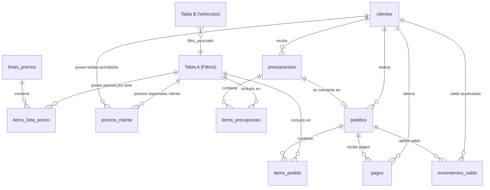

# FHL Filtros — Documentación Integral del Sistema y Panel de Administración

Este documento describe de manera exhaustiva la arquitectura técnica, modelo de datos, flujos comerciales, endpoints, módulos de administración y directivas de seguridad implementadas en la plataforma **FHL Filtros**.

---

## 1. Visión General del Proyecto

La plataforma se divide en dos grandes subsistemas:

1. **Catálogo Público de Consulta Rápida B2B/B2C (`/`)**:
   - Búsqueda instantánea de filtros de habitáculo por código (FHL, OEM o equivalencias cruzadas de primeras marcas como Wega, Fram, Mann Filter, Mahle, Bosch, Tecfil).
   - Buscador guiado por vehículos en cascada (Marca → Modelo → Versión / Motorización / Año).
   - Fichas técnicas detalladas con dimensiones milimétricas, fotos de alta resolución y aplicaciones compatibles.
   - **Los precios se mantienen estrictamente ocultos del público general.**

2. **Panel de Administración Integral (`/admin`)**:
   - Sistema comercial, financiero y operativo cerrado para el control de inventario, clientes, cuentas corrientes, presupuestación en PDF, pedidos, cobranzas, listas de precios directas y auditoría con IA.

---

## 2. Stack Tecnológico

- **Framework**: [Next.js](https://nextjs.org/) (App Router, Server Components por defecto y Client Components interactivos con `'use client'`).
- **Lenguaje**: TypeScript (Strict Mode).
- **Base de Datos & Storage**: [Supabase](https://supabase.com/) (PostgreSQL relacional + Supabase Storage Bucket `productos`).
- **Estilos & UI**: TailwindCSS (diseño limpio, profesional, paleta HSL azul marino / pizarra corporativa, accesibilidad WCAG 2.1 AA, sin emojis).
- **Procesamiento de Archivos & PDF**:
  - `xlsx` para importación, exportación y análisis de planillas Excel (`.xlsx`, `.xls`) y `.csv`.
  - `jspdf` y `jspdf-autotable` para generación y descarga inmediata de presupuestos y comprobantes en PDF.
  - HTML5 Canvas API para compresión automática y conversión de fotos a formato `.webp` en el cliente.
- **Inteligencia Artificial**:
  - OpenRouter API con modelos gratuitos de alta precisión técnica: `nvidia/nemotron-3-nano-30b-a3b:free` y `nvidia/nemotron-3-nano-omni-30b-a3b-reasoning:free`.
  - Endpoints de servidor que custodian la clave de API con tolerancia a caídas (fallback automático).
- **Seguridad**: Autenticación HMAC-SHA256 con cookies seguras `HttpOnly` y protección en cliente mediante `AdminAuthGuard`.

---

## 3. Modelo de Base de Datos (Supabase PostgreSQL)



### Detalle de Tablas Principales

#### 1. `"Tabla A"` (Catálogo de Filtros)
| Columna | Tipo | Descripción |
| :--- | :--- | :--- |
| `id` | BIGINT (PK) | Identificador autoincremental |
| `codigo_fhl` | TEXT (UNIQUE) | Código FHL normalizado en mayúsculas (ej: `FHL-103`) |
| `equivalencias` | TEXT | Referencias OEM y cruces de marcas comerciales |
| `dimensiones` | TEXT | Medidas técnicas (ej: `291 mm x 159 mm x 30 mm`) |
| `descripcion_aplicacion` | TEXT | Resumen legible de vehículos compatibles |
| `imagen_url` | TEXT / JSON | URLs de imágenes en Supabase Storage |
| `buscador_unificado` | TEXT (GENERATED STORED) | Texto indexado sin espacios ni guiones para búsqueda |
| `precio` | NUMERIC(12,2) | Precio base de facturación interna |
| `activo` | BOOLEAN | `true` para visible en web, `false` para oculto |
| `eliminado` | BOOLEAN | `true` para papelera (soft-delete), `false` para activo |

#### 2. `"Tabla B"` (Aplicaciones por Vehículo)
| Columna | Tipo | Descripción |
| :--- | :--- | :--- |
| `id` | BIGINT (PK) | Identificador autoincremental |
| `marca` | TEXT | Marca del vehículo (ej: `CITROEN`, `FIAT`, `FORD`) |
| `modelo` | TEXT | Modelo comercial (ej: `BERLINGO`, `PALIO`, `FOCUS`) |
| `version` | TEXT | Motorización / versión (ej: `1.6 HDI`, `1.4 FIRE`) |
| `año` | TEXT | Rango de años de compatibilidad (ej: `2010 ->`) |
| `filtro_asociado` | TEXT | Código FHL vinculado (`Tabla A.codigo_fhl`) |
| `eliminado` | BOOLEAN | Estado de papelera |

#### 3. `listas_precios` (Listas de Precios Directas)
| Columna | Tipo | Descripción |
| :--- | :--- | :--- |
| `id` | UUID (PK) | Identificador único de la lista |
| `nombre` | TEXT | Nombre de la lista (ej: `Mayorista 1`, `Comercio`, `Distribuidor`) |
| `descripcion` | TEXT | Notas o alcance comercial |
| `tipo_ajuste` | VARCHAR(20) | `'excel'` (precios directos fijos) o `'porcentaje'` (ajuste masivo %) |
| `porcentaje` | NUMERIC(5,2) | Margen porcentual sobre el catálogo (+/- %) |
| `activa` | BOOLEAN | Habilitada para selección en el facturador |
| `es_predeterminada` | BOOLEAN | Lista predeterminada por defecto al abrir el facturador |
| `eliminado` | BOOLEAN | Estado de papelera |

#### 4. `items_lista_precio` (Precios Específicos por Filtro)
| Columna | Tipo | Descripción |
| :--- | :--- | :--- |
| `id` | BIGINT (PK) | Identificador |
| `lista_id` | UUID (FK) | Lista de precios propietaria |
| `codigo_fhl` | TEXT | Código de filtro |
| `precio` | NUMERIC(12,2) | Precio unitario fijado |
| `*Unique*` | `(lista_id, codigo_fhl)` | Índice único que impide duplicados por lista y código |

#### 5. `clientes` (Cuentas Corrientes y Clientes)
| Columna | Tipo | Descripción |
| :--- | :--- | :--- |
| `id` | UUID (PK) | Identificador único |
| `nombre` | TEXT | Razón social o nombre comercial |
| `cuit` | TEXT | CUIT / Identificación fiscal |
| `condicion_iva` | VARCHAR(50) | Responsable Inscripto, Monotributo, Exento, Consumidor Final |
| `tipo_cliente` | VARCHAR(50) | Mayorista, Distribuidor, Casa de Repuestos, Taller, Minorista |
| `email` / `telefono` | TEXT | Datos de contacto comercial |
| `direccion` / `ciudad` / `provincia` | TEXT | Ubicación y logística |
| `descuento_predeterminado` | NUMERIC(5,2) | Descuento comercial base (%) |
| `plazo_pago` | VARCHAR(50) | Contado, 15 días, 30 días, 60 días, Cuenta Corriente |
| `lista_precio_id` | UUID (FK) | Lista de precios asignada al cliente por defecto |
| `eliminado` | BOOLEAN | Estado de papelera |

#### 6. `precios_cliente` (Tarifas Personalizadas por Cliente)
| Columna | Tipo | Descripción |
| :--- | :--- | :--- |
| `id` | BIGINT (PK) | Identificador |
| `cliente_id` | UUID (FK) | Cliente propietario de la tarifa |
| `codigo_fhl` | TEXT | Código de filtro |
| `precio` | NUMERIC(12,2) | Precio especial acordado (prioridad máxima en facturación) |

#### 7. `pedidos` & `items_pedido`
- `pedidos`: Almacena el pedido con estado (`pendiente`, `confirmado`, `entregado`, `cancelado`), cliente vinculado, total, observaciones y soporte para papelera (`eliminado`).
- `items_pedido`: Desglose de filtros con cantidades y precio unitario pactado al momento de la venta.

#### 8. `pagos` & `movimientos_saldo`
- `pagos`: Registro de cobranzas imputadas a cada pedido (`efectivo`, `transferencia`, `cheque`, `mercadopago`, `saldo_a_favor`).
- `movimientos_saldo`: Libro mayor de créditos automáticos por excedentes o deducciones aplicadas.

---

## 4. Módulos del Panel de Administración (`/admin`)

El panel está organizado en **6 módulos principales**:

### 4.1. 🛒 Facturador Rápido, Presupuestador & Editor de Pedidos (`/admin/facturador`)
- **Resolución Lineal de Precios**:
  1. Si el cliente tiene un precio acordado personal (`precios_cliente`), lo aplica automáticamente.
  2. Si la lista seleccionada tiene un precio específico cargado (`items_lista_precio`), lo aplica.
  3. Si la lista es porcentual, aplica el % sobre el precio base del catálogo.
  4. Por defecto, toma el precio base del catálogo (`Tabla A.precio`).
- **Autoguardado en Tiempo Real (Protección de Borrador)**:
  - Mientras el usuario interactúa con el facturador, el estado se guarda continuamente en `localStorage`.
  - Si la página se cierra, se corta la luz o se recarga la pestaña, se muestra una alerta superior destacada con el botón **"Restaurar Borrador"** (recuperando cliente, filtros, cantidades y observaciones).
  - Al completar el pedido, el borrador se elimina de forma limpia.
- **Edición Completa de Pedidos Existentes (`/admin/facturador?pedidoId=XYZ`)**:
  - Carga el cliente, observaciones y todos los filtros del pedido existente en modo edición.
  - Permite agregar/quitar filtros, cambiar cantidades o recalcular precios.
  - Al hacer click en **"Guardar Cambios"**, actualiza el pedido y sus ítems en la base de datos sin duplicar registros.
- **Generación de PDF**:
  - Motor integrado con `jsPDF` y `jspdf-autotable`.
  - Previsualización en vivo (iframe en escritorio, pantalla completa en móviles).

### 4.2. 📦 Pedidos y Remitos (`/admin/pedidos` y `/admin/pedidos/[id]`)
- **Control de Ciclo de Vida**: Estados `pendiente` → `confirmado` → `entregado` / `cancelado`.
- **Acceso Directo a Edición**: Botón ✏️ en la tabla de pedidos y botón destacado **"Editar Pedido"** en la ficha individual.
- **Cobranzas y Cuentas**: Registro de pagos parciales o totales, imputación automática de saldo a favor del cliente y control de deuda pendiente.
- **Papelera (Soft-delete)**: Restauración o borrado definitivo de pedidos.

### 4.3. 👥 Clientes & Cuentas Corrientes (`/admin/clientes` y `/admin/clientes/[id]`)
- Gestión de clientes, CUIT, condición de IVA, listas asignadas y plazos de pago.
- Editor de **Precios Acordados por Cliente** para filtros específicos.
- Historial de cuenta corriente, libro mayor de saldo a favor y resumen de deuda.

### 4.4. 🏷️ Catálogo de Filtros y Vehículos (`/admin/productos`)
- Gestión unificada de filtros (`Tabla A`) y aplicaciones vehiculares (`Tabla B`).
- **Importador Excel Inteligente**:
  - Carga masiva con detección automática de columnas (`Código`, `Equivalencias`, `Dimensiones`, `Aplicación`, `Precio`, `Activo`).
  - Previsualización diferencial (Nuevos, Actualizados, Sin cambios, Errores).
  - Subida de imágenes con optimización y compresión a WebP.
- Papelera de reciclaje independiente para filtros y aplicaciones.

### 4.5. 💵 Listas de Precios Directas (`/admin/listas-precios`)
- **Listas Pre-cargadas Sincronizadas**:
  - `Mayorista 1` (Predeterminada) — 114 filtros
  - `Mayorista 2` — 114 filtros
  - `Mayorista 3` — 114 filtros
  - `Mayorista Base` — 114 filtros
  - `MDP con Bolsa` — 114 filtros
  - `MDP c/Bolsa Starfilt` — 114 filtros
  - `Comercio` — 114 filtros
- **Importador Excel de 2 Columnas**:
  - Detecta automáticamente columnas `[Filtro / Código, Precio]`.
  - Descarga de plantilla oficial de 2 columnas pre-cargada con los filtros del catálogo.
- **Editor Interactivo de Precios (`ModalVerPreciosLista.tsx`)**:
  - **Edición Inline**: Click en cualquier precio para modificarlo y guardarlo con `Enter`.
  - **Ajuste Masivo por %**: Aumento o descuento global para toda la lista con redondeo configurable.
  - **Poblar desde Catálogo**: Carga rápida de todos los filtros del catálogo con 1 click.
  - **Exportar Excel**: Descarga limpia en formato `.xlsx`.

### 4.6. 🤖 Auditoría de Catálogo con IA (`/admin/auditoria`)
- **Motor de Ingesta al 100%**: Contexto completo de todos los filtros y matrices de compatibilidad de marcas de vehículos.
- **Modelos IA Gratis Verificados**:
  1. `nvidia/nemotron-3-nano-30b-a3b:free`
  2. `nvidia/nemotron-3-nano-omni-30b-a3b-reasoning:free`
  3. `openrouter/free` (fallback de seguridad)
- **Chatbot Asistente Técnico**: Consultas cruzadas, cruce de códigos OEM y generación de tablas comparativas en Markdown.
- **Auditoría de Planillas Excel**: Sube cualquier planilla externa de listas de precios o proveedores para detectar anomalías, precios desfasados y cruces con FHL.

---

## 5. Endpoints de API y Seguridad

| Endpoint | Método | Descripción |
| :--- | :---: | :--- |
| `/api/auth/login` | `POST` | Autentica credenciales y emite cookie `fhl_admin_session` (HMAC-SHA256) |
| `/api/auth/logout` | `POST` | Invalida y elimina la cookie de sesión |
| `/api/auth/check` | `GET` | Valida la validez de la sesión activa |
| `/api/admin/auditoria-chat` | `POST` | Endpoint de servidor que ejecuta las consultas del chat IA con OpenRouter |
| `/api/admin/auditoria-excel` | `POST` | Endpoint de servidor que procesa y audita planillas Excel con IA |

### Variables de Entorno (`.env.local`)

```env
# Supabase Backend
NEXT_PUBLIC_SUPABASE_URL=https://tu-proyecto.supabase.co
NEXT_PUBLIC_SUPABASE_ANON_KEY=tu_clave_anonima_publica_aqui

# Credenciales de Administrador
ADMIN_USER=admin
ADMIN_PASSWORD=tu_contraseña_segura
ADMIN_SECRET=tu_clave_secreta_de_sesion_segura

# Inteligencia Artificial (OpenRouter)
OPENROUTER_API_KEY=tu_clave_de_openrouter_aqui
```

---

## 6. Comandos de Mantenimiento y Ejecución

```bash
# Instalar dependencias
npm install

# Correr servidor de desarrollo
npm run dev

# Compilar build de producción y validar TypeScript (21 rutas)
npm run build

# Iniciar servidor de producción
npm start
```
